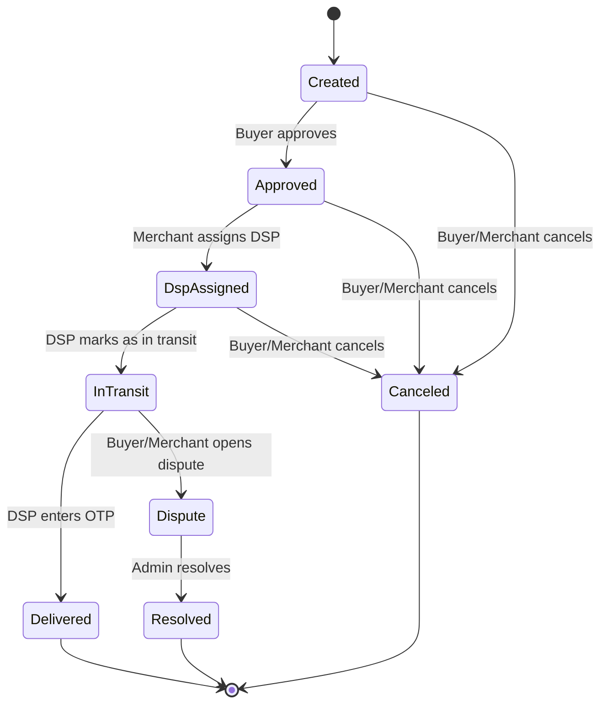

# PeacePay Technical Requirements v3.0

**Date:** January 10, 2026
**Author:** Manus AI

## 1. Introduction

This document provides a comprehensive overview of the technical requirements for the PeacePay platform. It is based on a detailed review of the following documents:

- PeaceLink Test Scenarios v1.2
- Test Cases Report (Done)
- Features and Process v2.1
- PeaceLink Rules v1.0
- VALIDATION_UPDATES.md

This document is intended to guide the development team in implementing the remaining features and ensuring the platform is robust, secure, and aligns with the business requirements. It consolidates all the rules, scenarios, and features into a single source of truth.

## 2. PeaceLink State Machine

The PeaceLink state machine is the core of the PeacePay platform. It defines the lifecycle of a PeaceLink from creation to completion. The following diagram illustrates the state machine:

### 2.1. State Definitions

| State | Description |
|---|---|
| **Created** | The PeaceLink has been created by the merchant but not yet approved by the buyer. |
| **Approved** | The buyer has approved the PeaceLink and the funds are held in escrow. |
| **DspAssigned** | The merchant has assigned a Delivery Service Provider (DSP) to the PeaceLink. |
| **InTransit** | The DSP has marked the PeaceLink as in transit. |
| **Delivered** | The DSP has successfully delivered the package and entered the OTP. |
| **Canceled** | The PeaceLink has been canceled by the buyer or merchant. |
| **Dispute** | A dispute has been opened by the buyer or merchant. |
| **Resolved** | The dispute has been resolved by the admin. |

### 2.2. State Transitions

State transitions are triggered by specific actions taken by the buyer, merchant, DSP, or admin. The following table details the state transitions and the associated rules:

| From State | To State | Triggering Action | Rules |
|---|---|---|---|
| Created | Approved | Buyer approves the PeaceLink | Funds are moved from the buyer's wallet to the escrow account. |
| Created | Canceled | Buyer or merchant cancels | Funds are returned to the buyer's wallet. |
| Approved | DspAssigned | Merchant assigns a DSP | The DSP is notified of the new assignment. |
| Approved | Canceled | Buyer or merchant cancels | See Cancellation Rules (Section 3). |
| DspAssigned | InTransit | DSP marks as in transit | The buyer is notified that the package is on its way. |
| DspAssigned | Canceled | Buyer or merchant cancels | See Cancellation Rules (Section 3). |
| InTransit | Delivered | DSP enters the correct OTP | Funds are released from escrow to the merchant and DSP. |
| InTransit | Dispute | Buyer or merchant opens a dispute | The dispute resolution process is initiated. |
| Delivered | - | - | The PeaceLink is considered complete. |
| Dispute | Resolved | Admin resolves the dispute | Funds are released according to the admin's decision. |
| Canceled | - | - | The PeaceLink is considered closed. |

## 3. Cancellation Rules

Cancellation rules are critical to ensure fairness and protect all parties involved in a transaction. The following table summarizes the cancellation rules based on the triggering party and the state of the PeaceLink:

| Scenario | Triggering Party | Buyer Outcome | Advance Treatment | DSP Fee Treatment | Merchant Outcome | PeacePay Profit |
|---|---|---|---|---|---|---|
| Buyer cancels before DSP assignment | Buyer | Full refund (item + delivery) | Refunded only if merchant fault, otherwise not refunded | Not applicable | No payout | Kept if already earned |
| Buyer cancels after DSP assignment | Buyer | Item amount only | Not refunded | Buyer pays DSP fee | No payout | Kept |
| Buyer cancels after OTP | Buyer | ❌ Not allowed | ❌ | ❌ | ❌ | ❌ |
| Merchant cancels before DSP assignment | Merchant | Full refund | Refunded | Not applicable | No payout | Kept |
| Merchant cancels after DSP assignment | Merchant | Full refund | Refunded | Merchant pays DSP fee even if by policy paid by buyer | No payout | Kept |
| Merchant cancels after delivery (OTP used) | Merchant | ❌ Not allowed | ❌ | ❌ | ❌ | Kept |

## 4. Fee Structure

The PeacePay fee structure is designed to be transparent and competitive. The following table outlines the fees for each transaction type:

| Fee Type | Amount | Charged To | Notes |
|---|---|---|---|
| Merchant Fee | 1% of item price + 3 EGP | Merchant | Charged on successful delivery. |
| DSP Fee | 1% of delivery fee | DSP | Charged on successful delivery. |
| Advance Payment Fee | 1% of advance amount | Merchant | Charged when the buyer approves the advance payment. |
| Cash-out Fee | 2% of cash-out amount | Merchant/DSP | Charged on cash-out requests. |

### 4.1. Fee Calculation Examples

**Scenario 1: Successful Delivery (No Advance)**

- Item Price: 1000 EGP
- Delivery Fee: 100 EGP

- **Merchant Payout:** 1000 - (1000 * 0.01 + 3) = 987 EGP
- **DSP Payout:** 100 - (100 * 0.01) = 99 EGP
- **PeacePay Profit:** 13 + 1 = 14 EGP

**Scenario 2: Successful Delivery (With 50% Advance)**

- Item Price: 2000 EGP
- Delivery Fee: 100 EGP
- Advance Payment: 1000 EGP

- **Advance Payout (to Merchant):** 1000 - (1000 * 0.01) = 990 EGP
- **Final Payout (to Merchant):** 1000 - (1000 * 0.01 + 3) = 987 EGP
- **DSP Payout:** 100 - (100 * 0.01) = 99 EGP
- **PeacePay Profit:** 10 + 13 + 1 = 24 EGP

## 5. Multi-Role System

The PeacePay platform supports three user roles: Buyer, Merchant, and DSP. Each role has a specific set of permissions and capabilities.

| Feature | Buyer | Merchant | DSP |
|---|---|---|---|
| Create PeaceLink | ❌ | ✅ | ❌ |
| Approve PeaceLink | ✅ | ❌ | ❌ |
| Cancel PeaceLink | ✅ | ✅ | ❌ |
| Assign DSP | ❌ | ✅ | ❌ |
| Mark as In Transit | ❌ | ❌ | ✅ |
| Enter OTP | ❌ | ❌ | ✅ |
| Open Dispute | ✅ | ✅ | ✅ |
| Switch Role | ✅ | ✅ | ✅ |

### 5.1. Role Switching

Users with multiple roles can switch between them at any time from their profile screen. The UI should clearly indicate the current role and provide a simple way to switch to other available roles. When a user switches roles, the app should navigate to the appropriate dashboard for that role.

## 6. OTP and Security

### 6.1. OTP Visibility

The OTP is a critical security feature that ensures the package is delivered to the correct person. The OTP should only be visible to the buyer under the following conditions:

- The user is the buyer.
- The `otpVisible` flag from the backend is true.
- The PeaceLink status is `DspAssigned` or `InTransit`.

### 6.2. Brute Force Attack Protection

To prevent brute force attacks on the OTP and PIN, the following measures should be implemented:

- After 3 incorrect OTP/PIN attempts, the account should be temporarily locked for 5 minutes.
- After 5 incorrect attempts, the account should be locked for 30 minutes.
- After 10 incorrect attempts, the account should be locked until the user resets their PIN via OTP.

### 6.3. Auto Logout

For security reasons, users should be automatically logged out after 3 minutes of inactivity.

## 7. Other Feature Requirements

### 7.1. Transaction History
- Users should be able to view a detailed history of all their transactions.
- The transaction history should be searchable and filterable by date, status, and payment method.
- Merchants should be able to download their transaction history in CSV and PDF formats.

### 7.2. KYC
- Users must complete KYC with their ID before they can cash out.
- There should be an option to upgrade to a higher KYC level with a wet signature for higher transaction limits.

### 7.3. Notifications
- Users should receive SMS notifications for all financial transactions.
- Merchants should receive push notifications for important updates and reminders.

### 7.4. Enterprise Merchant Onboarding

The onboarding process for enterprise merchants should be as follows:

1.  **Checkout & PeaceLink Creation:** The merchant's backend calls the PeacePay API to create a PeaceLink.
2.  **Redirect to PeacePay Web App:** The buyer is redirected to the PeacePay web app to approve the payment.
3.  **Merchant Portal for Operations:** The merchant uses the PeacePay portal to manage their PeaceLinks.
4.  **Delivery & Payout:** The DSP collects the OTP from the buyer to release the payment.
5.  **Refunds:** Refunds are triggered via the merchant portal.
